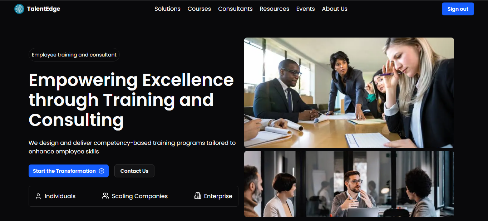

<div align="center">
  <br />
    <a href="https://www.linkedin.com/in/stephen-ekele-3a228327b" target="_blank">
      
    </a>
  <br />

  <div>
    
    
    
    
    
  </div>

  <h3 align="center">Employee Consultant App By Ekele Stephen</h3>

</div>

## 📋 <a name="table">Table of Contents</a>

1. 🤖 [Introduction](#introduction)
2. ⚙️ [Tech Stack](#tech-stack)
3. 🔋 [Features](#features)
4. 🤸 [Quick Start](#quick-start)

## <a name="introduction">🤖 Introduction</a>

Built with Next.js, TypeScript, and Postgres, the Employee Consultant App is a production-grade app featuring a public-facing app and an admin interface. It offers advanced functionalities like seamless scheduling, courses, company consultants, solutions, events, resources, and a modern, optimized tech stack for real-world scalability.

## <a name="tech-stack">⚙️ Tech Stack</a>

- Next.js
- PostgreSQL
- Upstash
- TypeScript
- Tailwind CSS

## <a name="features">🔋 Features</a>

### Features of the University Library Management System Project

👉 **Open-source Authentication**: Personalized Email and Password auth with next-auth.  

👉 **Home Page**: Highlights of courses, solutions, testimonials and more.  

👉 **Courses Page**: Full list of courses with sorting and pagination.  

👉 **Solutions Page**: Full list of solutions with sorting and pagination. 

👉 **Consultants Page**: Full list of consultants with sorting and pagination.  

👉 **Resources Page**: Full list of resources with sorting and pagination.

👉 **Events Page**: Full list of events with sorting and pagination.

👉 **About Us**: A detailed company about us  

👉 **Analytics Dashboard**: Statistics, list and action buttons for all features listed above

👉 **Role Management**: Change user roles to invite more admins.

👉 **Advanced Functionalities**: Caching, rate-limiting, DDoS protection, and custom notifications.  

👉 **Database Management**: Postgres with Neon for scalable and collaborative database handling.  

👉 **Real-time Media Processing**: ImageKit for image and video optimization and transformations. 

👉 **Efficient Caching**: Upstash Redis for caching, workflows, and triggers.  

👉 **Database ORM**: Drizzle ORM for simplified and efficient database interactions.  

👉 **Modern UI/UX**: Built with TailwindCSS, ShadCN, and other cutting-edge tools.  

👉 **Technology Stack**: Next.js with TypeScript for scalable development, and NextAuth for robust authentication.  

👉 **Seamless Email Handling**: Email communications, including notifications and updates.  

and many more, including code architecture and reusability 

## <a name="quick-start">🤸 Quick Start</a>

Follow these steps to set up the project locally on your machine.

**Prerequisites**

Make sure you have the following installed on your machine:

- [Git](https://git-scm.com/)
- [Node.js](https://nodejs.org/en)
- [npm](https://www.npmjs.com/) (Node Package Manager)

**Cloning the Repository**

```bash
git clone https://github.com/SirAges/talentedge.git
cd talentedge
```

**Installation**

Install the project dependencies using npm:

```bash
npm install
```

**Set Up Environment Variables**

Create a new file named `.env` in the root of your project and add the following content:

```env
NEXT_PUBLIC_API_ENDPOINT=
NEXT_PUBLIC_PROD_API_ENDPOINT=

DATABASE_URL=

UPSTASH_REDIS_URL=
UPSTASH_REDIS_TOKEN=

AUTH_SECRET=

# Required for workflow
QSTASH_URL=
QSTASH_TOKEN=

# Email
EMAIL_HOST=
EMAIL_PORT=
EMAIL_USER=
EMAIL_PASS=

```

Replace the placeholder values with your actua NeonDB, Upstash, and Email credentials. You can obtain these credentials by signing up on the [NeonDB](https://console.neon.tech), [Upstash](https://console.upstash.com)

**Running the Project**

```bash
npm run dev
```

Open [http://localhost:3000](http://localhost:3000) in your browser to view the project.